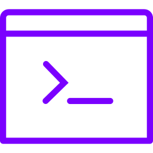

= console
:author: Philip Michael Raab
:email: <philip@cathedral.co.za>
:keywords: library,inanepain,composer,php,console,routing,route,router,command,argument
:description: Console routing and argument handling.
:revnumber: 0.3.0
:revdate: 2026-01-14
:copyright: Unlicense
:experimental:
:hide-uri-scheme:
:icons: font
:source-highlighter: highlight.js
:toc: left
:sectanchors:
:toclevels: 3
:idprefix: topic-
:idseparator: -
:pkg-vendor: inanepain
:pkg-name: console
:pkg-id: {pkg-vendor}/{pkg-name}

==  {pkg-id}

{description}

:sectnums: |,all|

:leveloffset: +1

== Introduction

The PHP Console Router is a modern, attribute-based command-line application framework for PHP 8+. It provides an elegant way to define CLI commands using PHP attributes, automatic argument parsing, and beautiful help documentation.

=== Features

* ✅ Attribute-based command definition
* ✅ Automatic argument and option parsing
* ✅ Short and long option formats (`-f`, `--force`)
* ✅ Required and optional arguments
* ✅ Default values for parameters
* ✅ Command aliases
* ✅ Automatic help generation
* ✅ Color-coded terminal output
* ✅ Command grouping by namespace

=== Requirements

* PHP 8.0 or higher
* CLI SAPI (command-line interface)

:leveloffset!:

<<<

:leveloffset: +1

== Install

[source,shell]
====
$ composer require {pkg-id}
====

=== Basic Setup

.Create your project structure:
[source,bash]
----
project/
├── console.php
├── src/
│   ├── AppCommands.php
----

.Create your `console.php` bootstrap file:
[source,php]
----
<?php
require_once 'vendor/autoload.php'; // or your autoloader

$router = new ConsoleRouter($argv);
$router->register(AppCommands::class);
exit($router->run());
----

.Make it executable:
[source,bash]
----
chmod +x console.php
----

:leveloffset!:

<<<

:leveloffset: +1

== Quick Start

=== Your First Command

Create a simple command that greets a user:

[source,php]
----
<?php

class HelloCommands
{
    #[Command('hello', 'Say hello to someone')]
    public function hello(
        #[Argument('Name of the person to greet')]
        string $name
    ): int {
        echo "Hello, {$name}!" . PHP_EOL;
        return 0;
    }
}
----

Register and run:

[source,php]
----
$router = new ConsoleRouter($argv);
$router->register(HelloCommands::class);
exit($router->run());
----

Usage:

[source,bash]
----
php console.php hello John
# Output: Hello, John!
----

:leveloffset!:

<<<

:leveloffset: +1

== Core Concepts

=== Commands

Commands are defined using the `#[Command]` attribute on public methods.

==== Syntax

[source,php]
----
#[Command(string $name, string $description = '', array $aliases = [])]
----

==== Parameters

[cols="1,1,3"]
|===
|Parameter |Type |Description

|`$name`
|string
|The command name (e.g., 'cache:clear')

|`$description`
|string
|Human-readable description shown in help

|`$aliases`
|array
|Alternative names for the command
|===

==== Example

[source,php]
----
#[Command('cache:clear', 'Clear application cache', ['cc', 'clear'])]
public function clearCache(): int
{
    echo "Cache cleared!" . PHP_EOL;
    return 0;
}
----

Usage:

[source,bash]
----
php console.php cache:clear
php console.php cc        # Using alias
php console.php clear     # Using alias
----

=== Arguments

Arguments are positional parameters that must be provided in order.

==== Syntax

[source,php]
----
#[Argument(string $description = '', bool $required = true, mixed $default = null)]
----

==== Parameters

[cols="1,1,3"]
|===
|Parameter |Type |Description

|`$description`
|string
|Description of the argument

|`$required`
|bool
|Whether the argument is required

|`$default`
|mixed
|Default value if not provided
|===

==== Example

[source,php]
----
#[Command('user:create', 'Create a new user')]
public function createUser(
    #[Argument('Username for the new user', required: true)]
    string $username,

    #[Argument('Email address', required: true)]
    string $email,

    #[Argument('User role', required: false, default: 'user')]
    string $role = 'user'
): int {
    echo "Creating user: {$username} ({$email}) as {$role}" . PHP_EOL;
    return 0;
}
----

Usage:

[source,bash]
----
php console.php user:create john john@example.com
php console.php user:create alice alice@example.com admin
----

=== Options

Options are named parameters that can be provided in any order using `--name` or `-n` syntax.

==== Syntax

[source,php]
----
#[Option(
    string $name,
    ?string $shortcut = null,
    string $description = '',
    mixed $default = null,
    bool $valueless = false
)]
----

==== Parameters

[cols="1,1,3"]
|===
|Parameter |Type |Description

|`$name`
|string
|Long option name (used with --)

|`$shortcut`
|string\|null
|Short option name (used with -)

|`$description`
|string
|Description of the option

|`$default`
|mixed
|Default value if not provided

|`$valueless`
|bool
|True for boolean flags (no value needed)
|===

==== Option Types

===== Value Options

Options that accept a value:

[source,php]
----
#[Command('send:email', 'Send an email')]
public function sendEmail(
    #[Option('to', 't', 'Recipient email address')]
    string $to,

    #[Option('subject', 's', 'Email subject', 'No Subject')]
    string $subject = 'No Subject'
): int {
    echo "Sending email to {$to}: {$subject}" . PHP_EOL;
    return 0;
}
----

Usage:

[source,bash]
----
php console.php send:email --to=john@example.com --subject="Hello"
php console.php send:email -t john@example.com -s "Hello"
----

===== Boolean Flags

Options that don't need a value (valueless):

[source,php]
----
#[Command('deploy', 'Deploy the application')]
public function deploy(
    #[Option('force', 'f', 'Force deployment', valueless: true)]
    bool $force = false,

    #[Option('dry-run', 'd', 'Preview without executing', valueless: true)]
    bool $dryRun = false
): int {
    if ($dryRun) {
        echo "DRY RUN: Would deploy application" . PHP_EOL;
        return 0;
    }

    echo "Deploying application" . ($force ? ' (forced)' : '') . PHP_EOL;
    return 0;
}
----

Usage:

[source,bash]
----
php console.php deploy --force
php console.php deploy -f -d
php console.php deploy --dry-run
----

:leveloffset!:

<<<

:leveloffset: +1

== Advanced Usage

=== Command Namespacing

Use colons (`:`) to organize commands into namespaces:

[source,php]
----
class DatabaseCommands
{
    #[Command('db:migrate', 'Run database migrations')]
    public function migrate(): int { /* ... */ }

    #[Command('db:seed', 'Seed the database')]
    public function seed(): int { /* ... */ }

    #[Command('db:reset', 'Reset the database')]
    public function reset(): int { /* ... */ }
}
----

These will be automatically grouped in the help output:

[source,bash]
----
Available Commands:

  db
    db:migrate          Run database migrations
    db:seed             Seed the database
    db:reset            Reset the database
----

=== Multiple Controllers

Register multiple command controllers:

[source,php]
----
$router = new ConsoleRouter($argv);
$router->register(DatabaseCommands::class);
$router->register(CacheCommands::class);
$router->register(UserCommands::class);
exit($router->run());
----

=== Exit Codes

Return appropriate exit codes from your commands:

[cols="1,3"]
|===
|Code |Meaning

|`0`
|Success

|`1`
|General error

|`2`
|Misuse of command

|`126`
|Command cannot execute

|`127`
|Command not found
|===

[source,php]
----
#[Command('validate', 'Validate configuration')]
public function validate(): int
{
    if (!file_exists('config.php')) {
        echo "Error: config.php not found" . PHP_EOL;
        return 1;
    }

    if (!$this->isValidConfig()) {
        echo "Error: Invalid configuration" . PHP_EOL;
        return 1;
    }

    echo "Configuration is valid!" . PHP_EOL;
    return 0;
}
----

=== Variadic argument Example

If the last parameter of a Command is an Argument, it can be variadic.

[source,php]
----
class Commands {
    #[Command('brew:attrib', 'Modify package properties', ['bha'])]
    public function attribCommand(
        #[Argument('Actions: install, uninstall, flag, unflag, hide, unhide, info', required: true, default: 'info')]
        string $action = 'info',

        // As manu packages as you wish
        #[Argument('List of packages', required: true)]
        string ...$packages,
    ): int {
        $formulas = $this->brew->getPackages(...$packages);
        foreach($formulas as $formula) {
            Cli::line('Brew package: ' . $formula->name);

            if ($action === 'install') {
                $formula->installed = true;
            } elseif ($action === 'uninstall') {
                $formula->installed = false;
            } elseif ($action === 'flag') {
                $formula->flag = true;
            } elseif ($action === 'unflag') {
                $formula->flag = false;
            } elseif ($action === 'hide') {
                if (!str_contains($formula->tags, 'hide')) {
                    $tags = explode(',', $formula->tags);
                    $tags[] = 'hide';
                    sort($tags);
                    $formula->tags = implode(',', array_unique($tags));
                }
            } elseif ($action === 'unhide') {
                if (str_contains($formula->tags, 'hide')) {
                    $tags = explode(',', $formula->tags);
                    $tags = array_diff($tags, ['hide']);
                    sort($tags);
                    $formula->tags = implode(',', array_unique($tags));
                }
            } else {
                $this->printFormula($formula, true);
            }
        }

        return 0;
    }
}
----

=== Complex Example

A comprehensive example combining all features:

[source,php]
----
class DeployCommands
{
    #[Command('deploy:app', 'Deploy application to server', ['deploy'])]
    public function deployApp(
        #[Argument('Target environment (staging/production)', required: true)]
        string $environment,

        #[Argument('Git branch to deploy', required: false, default: 'main')]
        string $branch = 'main',

        #[Option('force', 'f', 'Skip safety checks', valueless: true)]
        bool $force = false,

        #[Option('rollback', 'r', 'Rollback on failure', valueless: true)]
        bool $rollback = true,

        #[Option('timeout', 't', 'Deployment timeout in seconds', 300)]
        int $timeout = 300
    ): int {
        echo "Deploying branch '{$branch}' to {$environment}" . PHP_EOL;
        echo "Timeout: {$timeout}s" . PHP_EOL;

        if ($force) {
            echo "⚠️  Skipping safety checks" . PHP_EOL;
        }

        if (!$rollback) {
            echo "⚠️  Auto-rollback disabled" . PHP_EOL;
        }

        // Deployment logic here...

        echo "✓ Deployment successful!" . PHP_EOL;
        return 0;
    }
}
----

Usage examples:

[source,bash]
----
# Basic deployment
php console.php deploy:app staging

# Deploy specific branch
php console.php deploy:app production develop

# With options
php console.php deploy:app production --force --timeout=600

# Using shortcuts
php console.php deploy:app staging -f -t 120

# Using alias
php console.php deploy production main --force
----

:leveloffset!:

<<<

:leveloffset: +1

== Help System

=== Viewing Help

==== List All Commands

[source,bash]
----
php console.php
php console.php list
php console.php --help
php console.php -h
----

==== Command-Specific Help

[source,bash]
----
php console.php <command> --help
php console.php <command> -h
----

Example:

[source,bash]
----
php console.php user:create --help
----

Output:

----
Description:
  Create a new user

Usage:
  php console.php user:create <username> <email> [options]

Arguments:
  username             [required] Username for the new user
  email                [required] Email address

Options:
  -a, --admin          Create as admin user
  -h, --help           Display help for this command
----

=== Version Information

[source,bash]
----
php console.php --version
----

:leveloffset!:

<<<

:leveloffset: +1

== Best Practices

=== Command Design

. **Use descriptive names**: `user:create` instead of `ucreate`
. **Group related commands**: Use namespaces (`cache:clear`, `cache:warm`)
. **Keep commands focused**: One command = one task
. **Provide clear descriptions**: Help users understand what each command does

=== Error Handling

Always handle errors gracefully:

[source,php]
----
#[Command('file:process', 'Process a file')]
public function processFile(
    #[Argument('File path')]
    string $path
): int {
    if (!file_exists($path)) {
        echo "Error: File not found: {$path}" . PHP_EOL;
        return 1;
    }

    try {
        // Process file...
        echo "File processed successfully" . PHP_EOL;
        return 0;
    } catch (\Exception $e) {
        echo "Error: " . $e->getMessage() . PHP_EOL;
        return 1;
    }
}
----

=== User Feedback

Provide clear feedback to users:

[source,php]
----
#[Command('import:data', 'Import data from CSV')]
public function importData(
    #[Argument('CSV file path')]
    string $file
): int {
    echo "Starting import from {$file}..." . PHP_EOL;

    $rows = $this->readCsv($file);
    $total = count($rows);

    foreach ($rows as $i => $row) {
        $this->importRow($row);

        // Progress indicator
        if (($i + 1) % 100 === 0) {
            echo "Imported " . ($i + 1) . " / {$total} rows..." . PHP_EOL;
        }
    }

    echo "✓ Import complete! {$total} rows imported." . PHP_EOL;
    return 0;
}
----

:leveloffset!:

<<<

:leveloffset: +1

== API Reference

=== ConsoleRouter Class

==== Methods

===== `__construct(array $argv = [])`

Initialize the router with command-line arguments.

[source,php]
----
$router = new ConsoleRouter($argv);
----

===== `register(string $controllerClass): void`

Register a controller class containing commands.

[source,php]
----
$router->register(AppCommands::class);
----

===== `run(): int`

Execute the router and return exit code.

[source,php]
----
exit($router->run());
----

===== `getCommands(): array`

Get all registered commands (useful for debugging).

[source,php]
----
$commands = $router->getCommands();
var_dump($commands);
----

:leveloffset!:

<<<

:leveloffset: +1

== Troubleshooting

=== Common Issues

==== "Command not found"

**Problem**: Command doesn't appear in the list

**Solutions**:

* Ensure the controller class is registered
* Check that the method is `public`
* Verify the `#[Command]` attribute syntax
* Make sure PHP 8.0+ is being used

==== "Required argument missing"

**Problem**: Error when running command

**Solutions**:

* Check argument order matches method signature
* Verify `required: true` is set correctly
* Provide all required arguments when calling

==== Colors not showing

**Problem**: Terminal output has escape codes instead of colors

**Solutions**:

* Check terminal supports ANSI colors
* On Windows, use Windows Terminal or enable VT100 support
* Test with: `echo -e "\033[32mGreen text\033[0m"`

:leveloffset!:

<<<

:leveloffset: +1

== Examples Repository

=== Task Management CLI

[source,php]
----
class TaskCommands
{
    #[Command('task:add', 'Add a new task')]
    public function add(
        #[Argument('Task description')]
        string $description,

        #[Option('priority', 'p', 'Task priority (1-5)', 3)]
        int $priority = 3,

        #[Option('due', 'd', 'Due date (YYYY-MM-DD)')]
        ?string $dueDate = null
    ): int {
        // Add task logic
        return 0;
    }

    #[Command('task:list', 'List all tasks', ['tasks'])]
    public function list(
        #[Option('completed', 'c', 'Show completed tasks', valueless: true)]
        bool $completed = false
    ): int {
        // List tasks logic
        return 0;
    }

    #[Command('task:complete', 'Mark task as complete')]
    public function complete(
        #[Argument('Task ID')]
        int $id
    ): int {
        // Complete task logic
        return 0;
    }
}
----

:leveloffset!:
